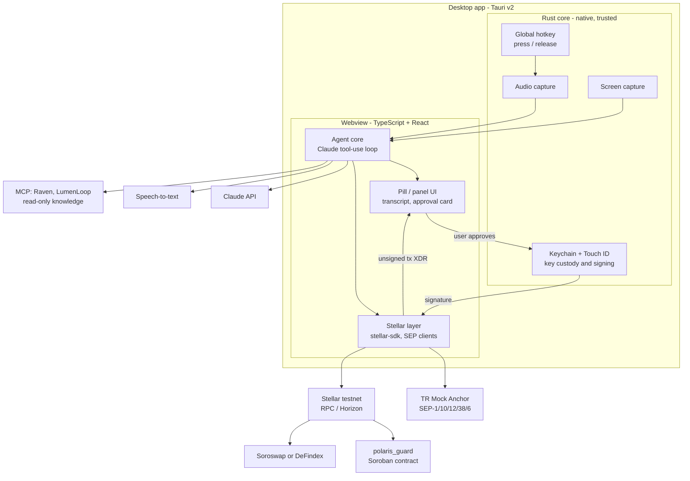
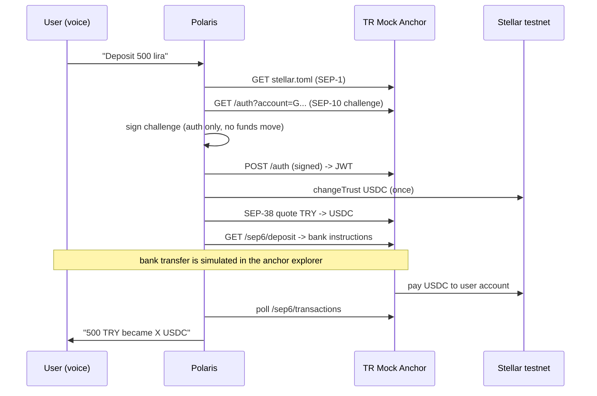

# Polaris — Architecture

> **Status:** living document. Working product name: **Polaris** (may change). Repo: `StellarVoiceControlProject`.
> Every claim tagged *verified* was checked on **2026-09-19** against the source named next to it.
> Status legend: ✅ decided · 🟡 proposed (needs team confirmation) · 🔲 open.
> *Last updated: 2026-09-19*

---

## 1. What we are building

A **push-to-talk voice assistant for Stellar developers and users**. The user holds a global hotkey and speaks; on release the assistant thinks, answers, and can act:

1. **Knows Stellar** — answers from official docs, skills, and live ecosystem data (via MCP servers).
2. **Moves money by voice** — e.g. "deposit 500 lira" runs a real TRY → USDC on-ramp through a Stellar anchor (SEP-6), then an action on an eligible protocol.
3. **Sees the screen** — reads what is on screen (errors, forms) and can fill inputs / click buttons.
4. **Never moves value on its own** — every value-moving step needs explicit user approval with **Touch ID**.

Track: **Genesis** (Stellar Pro Hackathon, 19–20 Sep 2026, submission deadline 20 Sep 12:00).

### Non-goals
- Mainnet, real money, or our own anchor implementation.
- Passkey smart wallet as a hard requirement (bonus only — see §5.4).
- A general-purpose desktop agent. Scope is Stellar workflows.

---

## 2. Hackathon requirements → design mapping

| Handbook requirement | How Polaris satisfies it | Status |
|---|---|---|
| **Anchor / local payments** (TRY in → usable balance; highest weight in *Ecosystem Fit*) | SEP-1/10/38/6 flow against the TR Mock Anchor, driven by voice | 🟡 |
| **Integration** with an eligible protocol, load-bearing | One of **Soroswap** (swap) or **DeFindex** (yield vault); picked by a testnet spike | 🔲 |
| **Own Soroban contract(s)** deployed on testnet, IDs documented | `polaris_guard` — on-chain spending policy + alias book + guarded payment | 🟡 |
| Real functionality, not mocked | Real testnet transactions; only the bank/KYC side is simulated by the anchor | 🟡 |
| Soroban auth & storage patterns | `require_auth` on owner; persistent storage for policy/aliases/daily counters | 🟡 |
| Cite Stellar Skills used (by path) | See §9 | 🟡 |
| README, architecture doc, demo, pitch deck | This file + README refresh + template deck | 🔲 |
| Bonus: passkeys / smart wallets | Optional Touch-ID passkey wallet; not required | 🔲 |

---

## 3. System overview

**Design principle:** the *brain* (agent loop, MCP, Stellar SDK, UI) is TypeScript. The *Rust core* stays thin and only does what needs native access or must be trusted: hotkey, audio, screen capture, key custody, Touch ID, signing. The brain is shell-agnostic, so it can be developed and tested headless before the shell exists (see §10).

---

## 4. Components

### 4.1 Voice pipeline
| Stage | Choice | Status |
|---|---|---|
| Trigger | Tauri global-shortcut plugin. Handler receives `ShortcutState::Pressed` / `Released` → hold-to-talk. *Verified:* docs.rs `tauri_plugin_global_shortcut`. | ✅ |
| Capture | Microphone via webview `getUserMedia` or Rust (`cpal`); decided in the shell spike | 🔲 |
| STT (Turkish) | **Not decided.** Current plan: try **Whisper** first (local `whisper-rs`/whisper.cpp — offline, no key, safe on flaky venue Wi-Fi — or a cloud Whisper API). If it proves unstable, fall back to a **multimodal model that accepts audio directly**. Caveat: we have *not* verified that Claude models accept audio input — check before relying on it; otherwise another provider's API is needed. Decide by spike: Turkish accuracy + latency | 🔲 |
| TTS | macOS `say -v Yelda` (free, Turkish voice) for MVP | 🟡 |
| Read-back | Assistant reads back parsed amount + recipient **before** any approval (guards against STT errors) | 🟡 |

### 4.2 Agent core
- **LLM:** Claude via the Anthropic API. Proposed `claude-sonnet-5` for the main loop (latency/cost); vision for screenshots. Optional `claude-haiku-4-5-20251001` for fast intent routing. Needs an API key, stored in a local, git-ignored `.env`. 🟡
- **Loop:** system prompt (Stellar-specialised, safety rules) → tool-use loop → structured result to UI. Tools are grouped by risk tier (§6).
- **Knowledge tools (MCP, read-only):** all *verified* 2026-09-19.

| MCP | Transport / auth | Notes |
|---|---|---|
| **Raven** `https://raven.stellar.buzz/mcp` | remote HTTP, OAuth (PKCE) | 2 tools: `search`, `execute` (sandboxed JS, no network; calls `stellarDocs.*`, `lumenloop.*`, `scout.*`). Has an anchor-specific op `stellarDocs.search_anchor_sep_docs`. Community project, listed by Stellar docs. |
| **LumenLoop** `https://mcp.lumenloop.com` | remote HTTP, no auth | 18 read-only tools (projects, SCF submissions, content) |
| **Scout** `npx -y @stellar-light/scout-mcp` v1.2.1 | local stdio | 21 tools. Overlaps Raven's `scout.*`; **not needed at runtime** if Raven works. `submit_feedback` sends data out — never send project details. |

- Raven's OAuth inside the app needs a localhost/deep-link callback → real work; fallback is LumenLoop + direct docs search. 🔲

### 4.3 Stellar layer
- **Account:** one Ed25519 `G…` account for the user. Required because SEP-10 supports only `G`/`M` accounts (§5.4).
- **Fees:** the user's account pays XLM fees; a relayer is not needed for classic transactions. *Launchtube is retired* (domain no longer resolves; Stellar docs point to OpenZeppelin Channels, `https://channels.openzeppelin.com/testnet`) — only relevant if we adopt smart accounts.
- **Anchor client:** candidate `@stellar/typescript-wallet-sdk` (official) or direct HTTP. 🔲
- **Tx building:** `@stellar/stellar-sdk` in the webview; the **unsigned XDR** is handed to the approval card, then to the Rust core for signing.

### 4.4 Screen awareness & control
- **Read:** screenshot (Rust `xcap` or equivalent) → Claude vision. Works in any app (e.g. read a compile error in VS Code).
- **Act (browser):** drive a controlled browser through **CDP / Playwright** for deterministic fill/click (anchor demo pages, Stellar Lab).
- **Act (other apps):** read-only in MVP.
- **Rule:** the agent may fill forms but **never presses the final submit of a financial action**; that is the user's Touch ID step.
- Sequenced **after** the money path (§10).

### 4.5 Key custody & approval
1. Agent produces an **intent** (structured, not a signature).
2. UI renders the approval card **from the decoded XDR** — *not* from the LLM's description of it.
3. Assistant reads back amount/recipient.
4. User authenticates with **Touch ID**; the Rust core releases the key and signs.
5. Result is submitted; hash + explorer link shown.

Touch ID in Tauri: the *official* biometric plugin targets mobile only; the community plugin **`tauri-plugin-biometry`** covers macOS Touch ID with secure data storage (*verified* via its repo/crates listing; must be proven in the spike). The Ed25519 secret lives in the Keychain, never in the webview or the repo. Secure Enclave cannot hold Ed25519 (P-256 only), so the key is a Keychain item gated by biometrics.

---

## 5. Stellar design details

### 5.1 Anchor flow (TR Mock Anchor)
*Verified facts* (from `https://tr-mock-anchor.fly.dev/.well-known/stellar.toml`): `WEB_AUTH_ENDPOINT` (SEP-10) `/auth`, `TRANSFER_SERVER` (SEP-6) `/sep6`, `KYC_SERVER` (SEP-12) `/sep12`, `ANCHOR_QUOTE_SERVER` (SEP-38) `/sep38`; network passphrase `Test SDF Network ; September 2015`; asset `USDC`, issuer `GBBD47IF6LWK7P7MDEVSCWR7DPUWV3NY3DTQEVFL4NAT4AQH3ZLLFLA5` (Circle testnet), `anchor_asset="TRY"`. **No SEP-24, no SEP-45.** Organizer notes: KYC and bank are simulated; deposit cap 3000 TRY per transaction; home domain + `USDC` is all that is needed. Reference guide: `https://tr-mock-anchor.fly.dev/sep`.

Exact request parameters are **to be confirmed against the anchor's guide** during implementation.

### 5.2 Protocol integration (core feature)
Eligible candidates from the handbook: Soroswap, DeFindex (official integration skills exist for both), also Aquarius, Blend v2, Stellar Broker. Demo narrative: *TRY → USDC (anchor) → "put my USDC to work" (DeFindex vault) or "swap to XLM" (Soroswap).* Choose one after a **testnet availability spike** (quote/vault reachable, liquidity exists). 🔲

### 5.3 `polaris_guard` (our Soroban contract) 🟡
Purpose: make the safety rule **enforceable on-chain**, so even a compromised agent cannot exceed the user's policy.

| Function (sketch) | Auth | Effect |
|---|---|---|
| `set_policy(owner, per_tx_limit, daily_limit, allowed_assets)` | `owner.require_auth()` | store policy (persistent storage) |
| `set_alias(owner, alias, address)` | `owner.require_auth()` | voice address book ("Ahmet" → `G…`) |
| `pay(owner, to_or_alias, asset, amount)` | `owner.require_auth()` | check per-tx + rolling daily limit (day = ledger time / 86400), then SEP-41 `transfer` |
| `get_policy`, `get_alias`, `spent_today` | none | reads |

Open design questions: does the guard also proxy protocol calls (swap/vault) or only payments? How is the daily counter keyed/expired (TTL)? 🔲
Build/deploy uses the toolchain in §11; the WASM path is `target/wasm32v1-none/release/<name>.wasm`.

### 5.4 Why not a passkey smart wallet as the main account
Passkey smart wallets are `C…` contract accounts. SEP-10 (what the mock anchor offers) supports only `G`/`M`; contract accounts authenticate via **SEP-45**, which is **Draft** (v0.1.1) and not offered by this anchor (*verified:* SEP-45 text in `stellar/stellar-protocol`; anchor's `stellar.toml`). So the anchor identity must be a `G` account. A passkey wallet stays a **bonus** for extra Soroban-auth credit.

---

## 6. Security model

**Principle:** the LLM proposes; the user disposes. Everything the model reads from outside is **data, not instructions**.

| Tier | Examples | Gate |
|---|---|---|
| 0 — read-only | doc search, balances, screenshots | none |
| 1 — UI actions | fill inputs, click non-financial buttons | logged; confirm per session |
| 2 — low-risk signatures | SEP-10 challenge, trustline | in-app confirm |
| 3 — value-moving | payment, swap, vault deposit | **read-back + Touch ID** |

Threats and mitigations:
- **Prompt injection** via screen text / web pages / MCP results → treated as untrusted data; Tier 3 cannot be reached without human approval; on-chain limits still apply.
- **STT mis-hearing** → read-back of amount + recipient; approval card built from XDR.
- **Key exposure** → Keychain + biometrics; key never in webview/logs/repo; testnet only.
- **Runaway agent** → per-tx and daily limits enforced by `polaris_guard`; client-side limits too.
- **Secrets in git** → `.env`, key files, and the Stellar CLI's project-local `.stellar/` (holds secret keys) are git-ignored via the root `.gitignore`. Keep API keys in a local `.env`; commit only a `.env.example` without values.

---

## 7. Technology decisions

| Area | Decision | Status |
|---|---|---|
| Shell | **Tauri v2** with a *thin Rust core* + TypeScript/React webview. Rationale: native press/release hotkey, key custody and signing outside the webview, Touch ID plugin exists, small footprint. **Not** because "Stellar uses Rust" — contracts are a separate project and app-side Stellar SDKs are JS-first. | ✅ (spike-gated) |
| Fallback | If the spike fails (hotkey, mic, Touch ID, or macOS permissions in dev builds), switch to **Electron**: the TS brain is reused unchanged. | ✅ |
| UI | React + TypeScript (Vite) | 🟡 |
| LLM | Claude API | 🟡 |
| STT / TTS | see §4.1 | 🔲 / 🟡 |
| Contracts | Rust + `soroban-sdk`, deployed with Stellar CLI | ✅ |
| Network | Stellar **testnet** only | ✅ |

**Shell spike gate (≈2 h, macOS):** in a Tauri dev build prove (1) hotkey press/release, (2) microphone capture, (3) Touch ID prompt + Keychain read via `tauri-plugin-biometry`, (4) a screenshot. Known risk to watch: an unbundled dev binary may attribute macOS privacy permissions (mic / screen / accessibility) to the parent terminal or IDE.

---

## 8. Build order

Agreed order: **assistant first → anchor → screen control.** The money path and the contract are handbook requirements, so they are scheduled, not optional.

| # | Milestone | Acceptance |
|---|---|---|
| **A** | **Brain, headless.** Text in → Claude → MCP tools → answer, run from a terminal | 10 Stellar questions (SEP-6/10, Soroban auth, testnet setup) answered correctly with tool calls succeeding; failures logged |
| **B** | **Voice shell.** Tauri app: hold hotkey, speak Turkish, get spoken + written answer | end-to-end works; latency measured; shell spike gate passed |
| **C** | **Anchor path.** Voice → SEP-10/38/6 → USDC balance on testnet | balance visible on Stellar explorer after simulated deposit |
| **D** | **Approval + guard.** Touch-ID approval card; `polaris_guard` deployed; protocol action | contract ID documented; over-limit payment rejected on-chain |
| **E** | **Screen awareness.** Read errors; browser fill/click; final submit gated | demo scene works without touching the mouse |
| **F** | **Submission.** README, this doc, contract IDs, deck, skill paths, demo | handbook checklist complete |

---

## 9. Stellar Skills used (to confirm at submission)
Handbook requires citing skill files by path. Candidates, from `https://skills.stellar.org/`:
`skills/standards/SKILL.md` (SEPs/CAPs) · `skills/smart-contracts/SKILL.md` · `skills/dapp/SKILL.md` · `skills/assets/SKILL.md` · `skills/data/SKILL.md` · DeFindex SDK / Soroswap SDK skills (whichever protocol is chosen). `skills/agentic-payments/SKILL.md` only if x402/MPP is actually used. Update this list as skills are really used.

---

## 10. Risks & open items

| Risk / question | Plan |
|---|---|
| Touch ID / hotkey / mic behave badly in Tauri dev builds | Shell spike gate (§7); Electron fallback |
| Raven OAuth inside the app | Fallback to LumenLoop + direct docs; keep Raven for dev-time use |
| STT quality for Turkish | Compare local whisper.cpp vs cloud in a quick spike |
| Chosen protocol has no testnet liquidity / vault | Availability spike first; keep both Soroswap and DeFindex as candidates |
| Anchor API details differ from assumptions | Follow `https://tr-mock-anchor.fly.dev/sep`; anchor changes are announced in the organizers' group |
| Time (~32 h to deadline) | Follow §8 order; cut screen *acting* before cutting anchor, guard, or approval |
| Handbook claims of a "Launchtube" requirement | Not in the handbook; service is retired. Ask organizers if in doubt |
| No LICENSE in repo | Choose a license before submission (public repo is required) |

Open decisions: STT provider · LLM/API providers beyond Claude · protocol (Soroswap vs DeFindex) · guard scope (payments only vs also protocol calls) · whether SEP-10 signing needs Touch ID · coordinator-model rules from `CLAUDE.md` (to be discussed before coding starts).

---

## 11. Toolchain (this dev machine, verified 2026-09-19)
Rust 1.98.1 (rustup) · targets `wasm32v1-none`, `wasm32-unknown-unknown` · Stellar CLI 28.0.0 · `soroban-sdk` 27.0.6 (via `stellar contract init`) · Node 24.16.0 (nvm) · VS Code + rust-analyzer + CodeLLDB · Claude Code CLI 2.1.277 · GitHub CLI 2.101.0.
Smoke test passed: identity → fund → `stellar contract build` → deploy to testnet → invoke.
> Doc gotcha: some Stellar docs still show `target/wasm32-unknown-unknown/release/...`; the real output of `stellar contract build` is under `target/wasm32v1-none/release/`.
